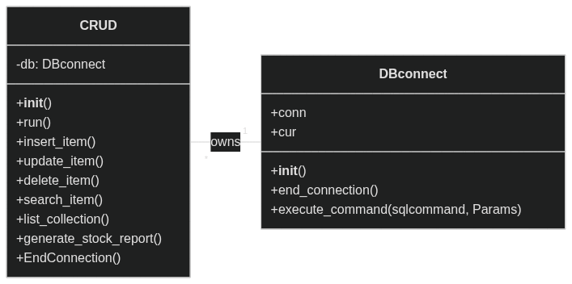

## Diagrama de Classes - SPEED HYPERMARKET Estoque



### First, create the virtual environment and install the components:
```
make install
```

### Secondly, create the DataBase correctly
```
make setup
```

### Finaly, to run
```
make run
```
